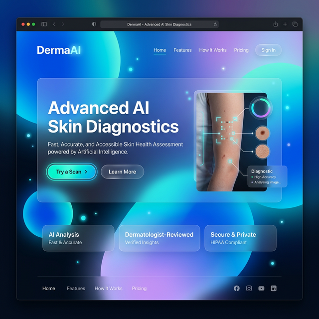
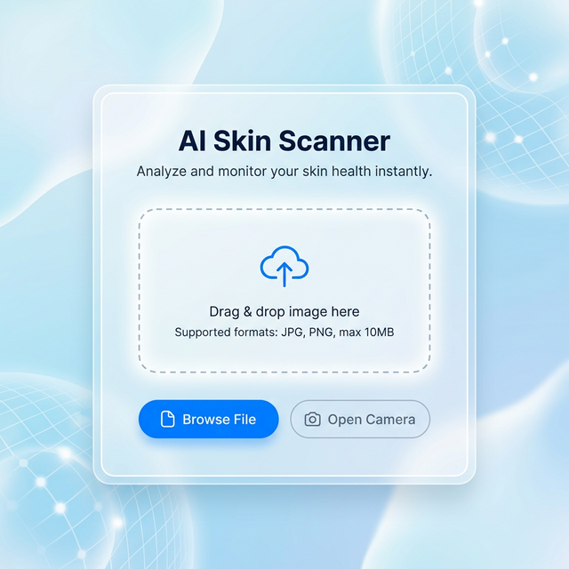
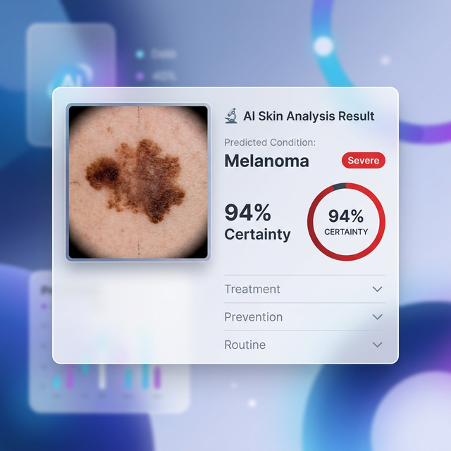

<div align="center">
  
  <br>
  <h1>DermaAI</h1>
  <p><strong>AI Skin Disease Detection and Recommendation System</strong></p>
</div>

<p align="center">
  
  
  
  
</p>

---

## 🚀 Project Overview

**DermaAI** is a comprehensive artificial intelligence healthcare application focused on the rapid classification, severity assessment, and recommendation of treatments for various skin conditions. This complete project was independently conceptualized, designed, coded, and developed from the ground up by **Zaira Khan**. 

### Concept & Purpose
The primary goal of DermaAI is to provide an accessible, highly accurate preliminary diagnostic system for skin health. By bridging the gap between advanced medical imaging and user-friendly web interfaces, the project serves as a practical healthcare solution that delivers instant analysis and actionable skincare advice to users. 

### System Architecture & Functionality 
The system features a robust, custom-built architecture that processes user uploads or real-time camera captures directly through a streamlined interface. The underlying logic seamlessly integrates deep learning models for classification, automatically assessing condition severity, and mapping the results to a tailored recommendation engine. The entire architecture—framing the frontend interactions, data pipeline, and backend routing—was intricately planned and implemented to ensure high performance and reliability.

### Innovation & Implementation
Beyond simple classification, DermaAI innovates by combining predictive modeling with a dynamic severity assessment algorithm and instant post-diagnostic care instructions. The development process involved rigorous structured research, logical problem-solving, and methodical step-by-step technical execution. From constructing the custom neural network pipelines to crafting the seamless user interface, every component reflects a deep commitment to modern system design.

The entire project lifecycle, including the foundational logic, architectural blueprint, frontend styling, backend coding, and model integration, was created and implemented solely by Zaira Khan using personal knowledge, applied research, and advanced programming skills. 

*This project is independently developed and maintained by Zaira Khan.*

---

## ✨ Key Features

- **🧠 Deep Learning Classification**: Detects 9 distinct skin conditions (Actinic Keratosis, Atopic Dermatitis, Benign Keratosis, Dermatofibroma, Melanocytic Nevus, Melanoma, Squamous Cell Carcinoma, Ringworm, and Vascular Lesions).
- **📊 Severity Assessment**: Automatically assigns a color-coded severity level (Mild, Moderate, Severe) to the diagnosed condition.
- **⚕️ AI Skincare Recommendations**: Generates immediate follow-up care instructions, including treatment options, prevention tips, and a recommended daily skincare routine.
- **📸 Real-Time Camera Scanner**: Capture skin images directly from a webcam instantly through the UI using web APIs and OpenCV integration—no file upload required.
- **🎨 Modern Aesthetic UI**: Features a beautiful glassmorphic design, dynamic mesh gradients, dark mode toggle, and micro-animations for a premium user experience.

---

## 💻 Tech Stack

- **Frontend**: HTML5, Vanilla CSS3 (Glassmorphism UI), JavaScript, Bootstrap 5
- **Backend**: Python 3, Flask framework, Werkzeug
- **Machine Learning**: TensorFlow, Keras, ResNet-50, Scikit-learn, Numpy, Pillow, OpenCV

---

## 📸 Screenshots

<div align="center">
  <h3>The Scan Interface</h3>
  
  <br><br>
  <h3>AI Analysis Result Card</h3>
  
</div>

---

## ⚙️ Installation Guide

Follow these steps to set up the project locally:

1. **Clone the repository:**
   ```bash
   git clone https://github.com/zairakhaan786/DermaAI.git
   cd DermaAI
   ```

2. **Create a virtual environment (Optional but recommended):**
   ```bash
   python -m venv venv
   source venv/bin/activate  # On Windows use: venv\Scripts\activate
   ```

3. **Install dependencies:**
   ```bash
   pip install -r requirements.txt
   ```

4. **Add the Model:**
   Ensure your trained `skin_model.h5` file is placed inside the `model/` directory.

---

## ▶️ How to Run the Project

1. **Start the Flask Server:**
   ```bash
   python app.py
   ```
2. **Access the App:**
   Open your browser and navigate to `http://localhost:5000` or `http://127.0.0.1:5000`.

---

## 📂 Project Structure

```text
/DermaAI
│
├── app.py                 # Core Flask application & routing
├── requirements.txt       # Project dependencies
├── README.md              # Project documentation
│
├── /model                 # Contains the trained neural network (e.g., skin_model.h5)
│
├── /utils                 # Helper scripts
│   └── recommendations.py # Logic for severity & skincare advice
│
├── /templates             # HTML Views
│   ├── index.html         # Landing page
│   ├── prediction.html    # Upload & Result dashboard
│   └── ...
│
├── /static                # Static frontend assets
│   ├── css/style.css      # Modern Glassmorphic Styles
│   ├── js/main.js         # Camera & UI Logic
│   └── uploads/           # Temporarily saved user scans
│
└── /assets                # High-quality UI mockups for documentation
```

---

## 🔮 Future Improvements

- [ ] Connect a PostgreSQL or MongoDB database to store past user scans and diagnoses securely.
- [ ] Implement user authentication (OAuth) for personalized dashboard history.
- [ ] Expand the classification model to support more rare skin conditions.
- [ ] Deploy the application to a cloud provider like AWS, Heroku, or Render.

---

## 📝 License

This project is licensed under the MIT License - see the [LICENSE](LICENSE) file for details.

<p align="center">
  <i>Developed at UPES, Dehradun, India | © 2023 Zaira Khan</i>
</p>
